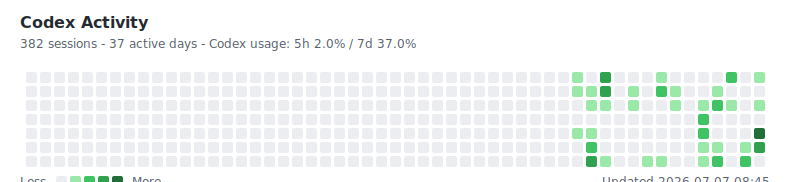

## Codex Activity



Manual update:

```powershell
powershell -ExecutionPolicy Bypass -File .\scripts\update-codex-activity.ps1
git add README.md assets\codex-activity.svg scripts\update-codex-activity.ps1
git commit -m "Update Codex activity"
git push
```

To change the headline numbers shown in the graph:

```powershell
powershell -ExecutionPolicy Bypass -File .\scripts\update-codex-activity.ps1 -Lifetime "5.91B" -Peak "353M" -Streak "2d" -BestStreak "49d" -LongestTask "5h 12m"
```

Only aggregated activity is published. Raw Codex logs stay local.
